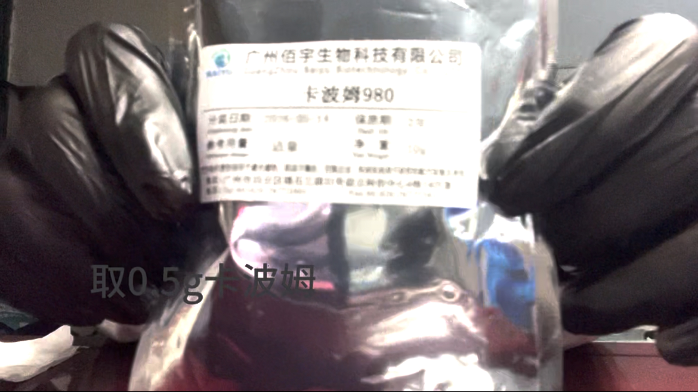
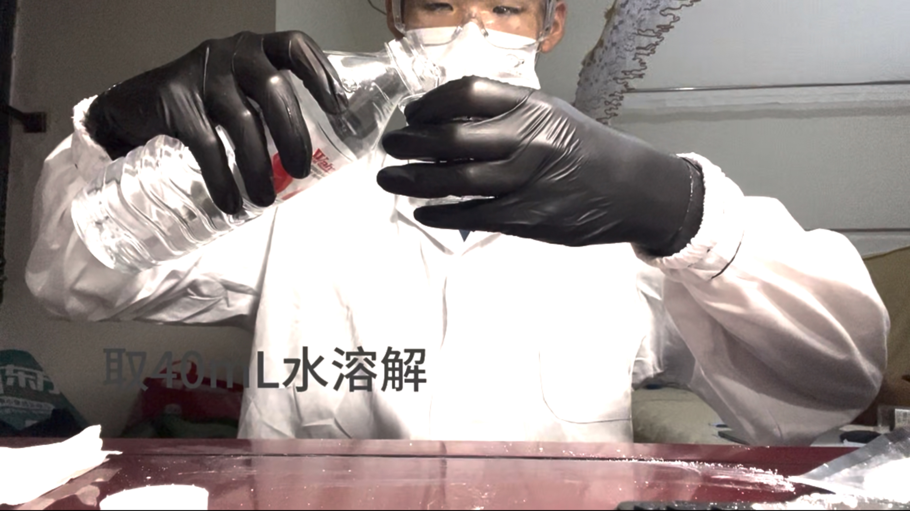
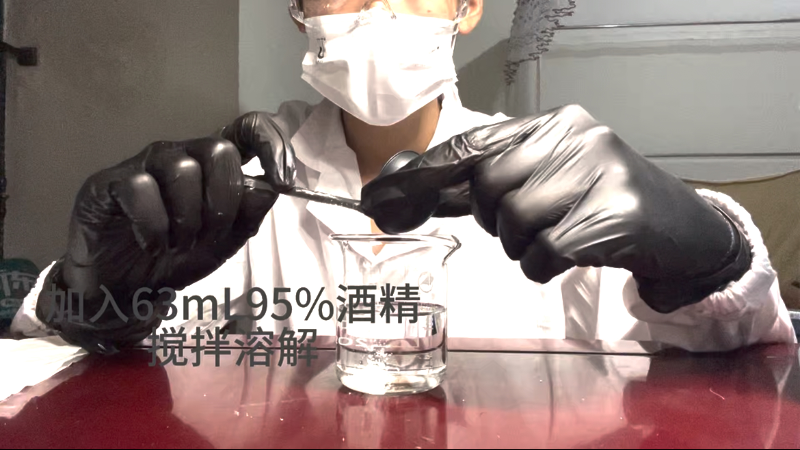
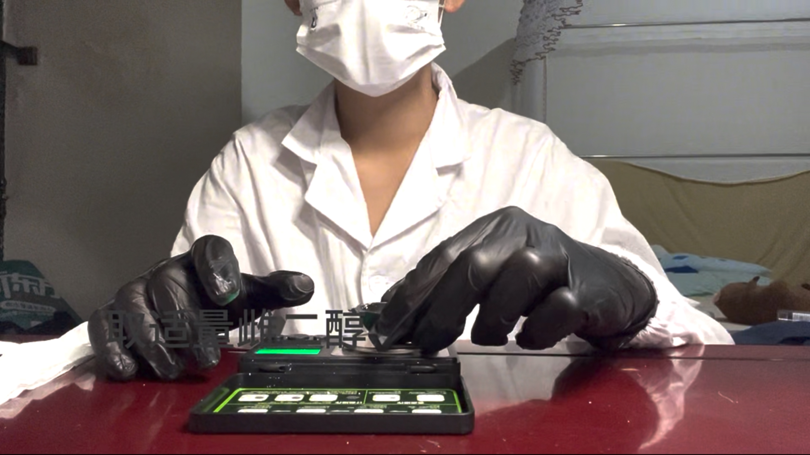
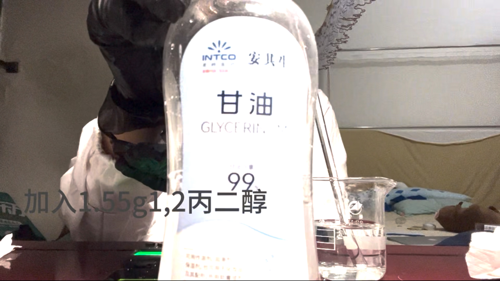
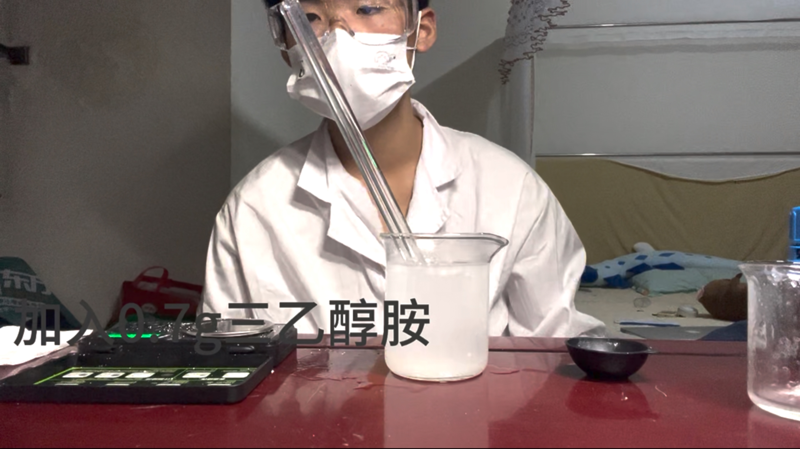
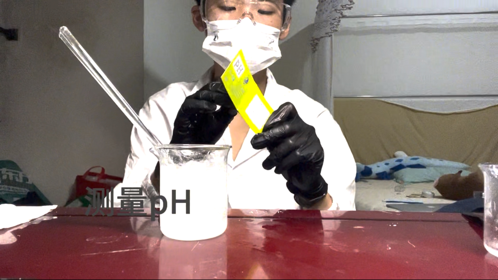
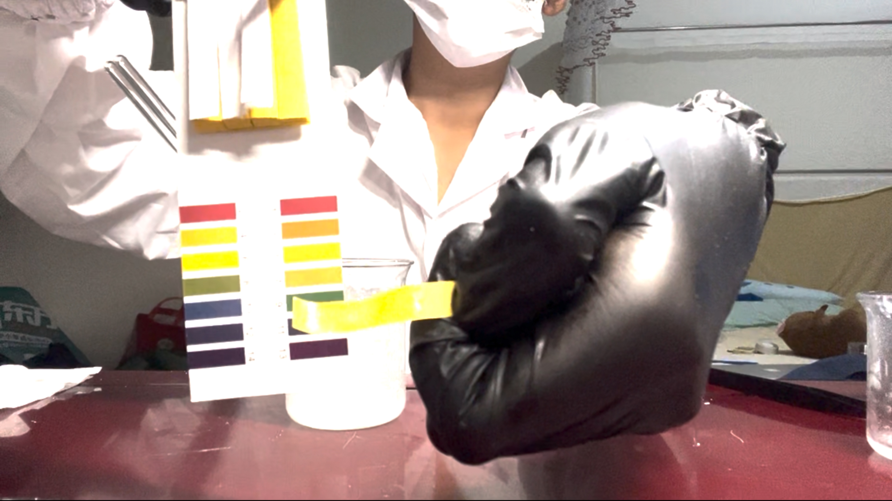
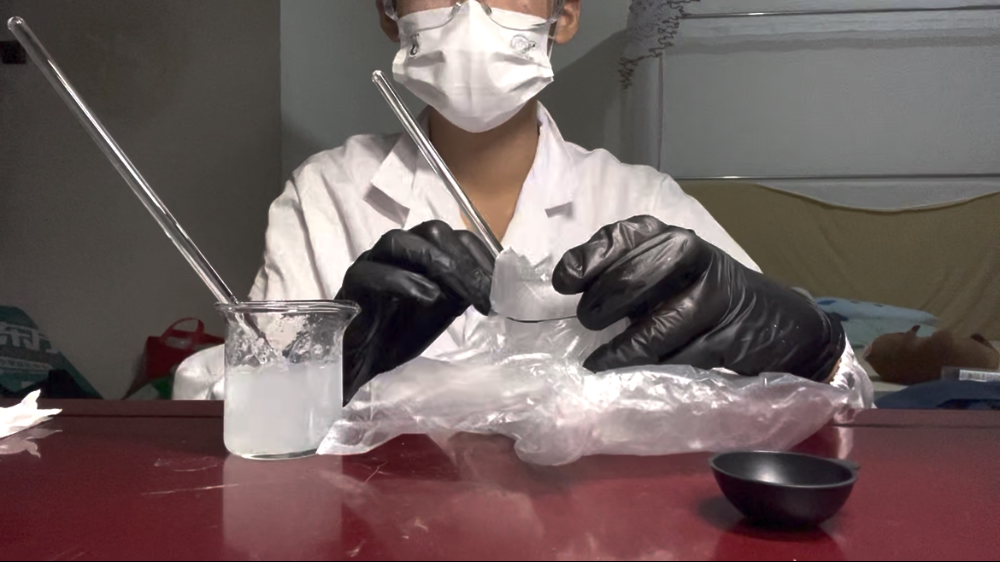
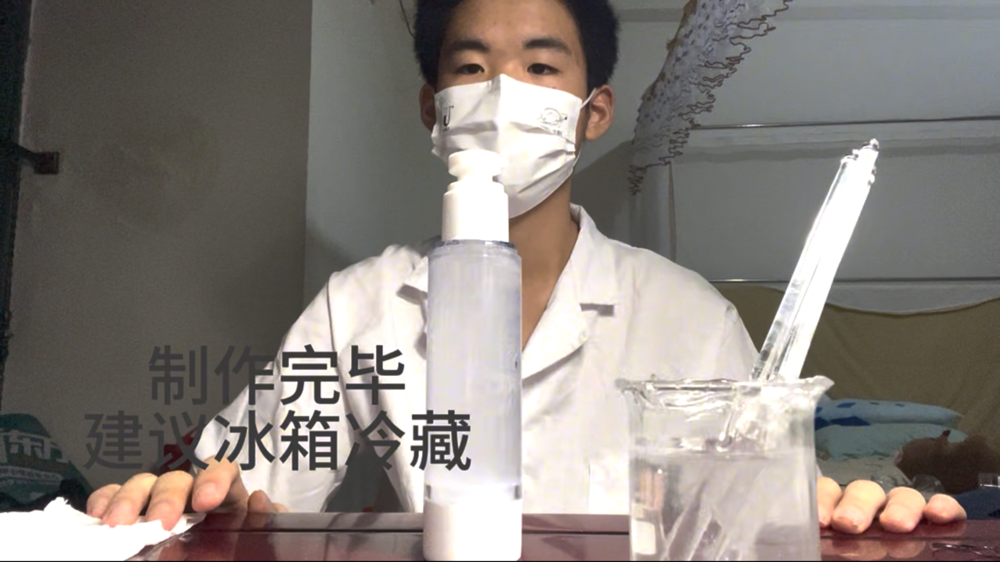

# 雌二醇凝胶的制作方法（以100mL凝胶为例）

**Estradiol Gel Preparation Tutorial**  
图文详细教程 + 视频版

> ⚠️ **重要提醒**：本教程仅供学习参考，请在专业人士指导下操作，严格遵守当地法律法规，注意安全。

**有不懂的地方可以私信问我**

---

## 🧪 制作前准备（必读）

- 所有器材（除废液桶和天平外）均已用**哇哈哈纯净水**清洗并消毒
- 桌面及手套已严格消毒
- **口罩一定要全程佩戴**
- **千万不要直接用手触摸任何试剂**
- 雌二醇添加量**可自定义**，推荐 **220mg**（其他物质严格按教程用量这样做出来凝胶浓度为0.22%）

---

## 📋 详细制作步骤

### 1. 称取卡波姆
取 **0.5g 卡波姆980**

### 2. 溶解卡波姆
取 **40mL 纯净水** 溶解卡波姆，搅拌至充分溶解。

### 3. 调雌二醇溶液
取 **220mg 雌二醇**（推荐），加入 **63mL 95% 酒精** 搅拌溶解。

### 4. 加入其他成分
- 加入 **1.4g 氮酮**
- 加入 **1.55g 甘油（1,2-丙二醇）**

### 5. 加入三乙醇胺
加入 **0.7g 三乙醇胺** 调节 pH。

### 6. 测量 pH 值
使用 pH 试纸测量溶液 pH 值。

### 7. 混合装瓶
充分搅拌混合均匀后装瓶，**建议冰箱冷藏保存**。

---

## 🎥 视频教程

[📹 点击观看完整视频版教程](https://1849778352.share.123865.com/123pan/UtXovd-tYmSA?pwd=gxfc#)

**作者 Twitter**：[@1gdsb](https://twitter.com/1gdsb)

---

## 🧼 制作后清理

- **桌面**：用**酒精 + 纸巾** 擦干净
- **器材**：建议先用水 + 酒精浸泡，再彻底清洗
- 废液请按危险废弃物妥善处理

---

## ⚠️ 安全提醒
- 全程佩戴手套、口罩、护目镜
- 在通风良好处操作
- 所有试剂请从正规渠道获取
- 本配方仅供参考，实际使用请咨询专业医师